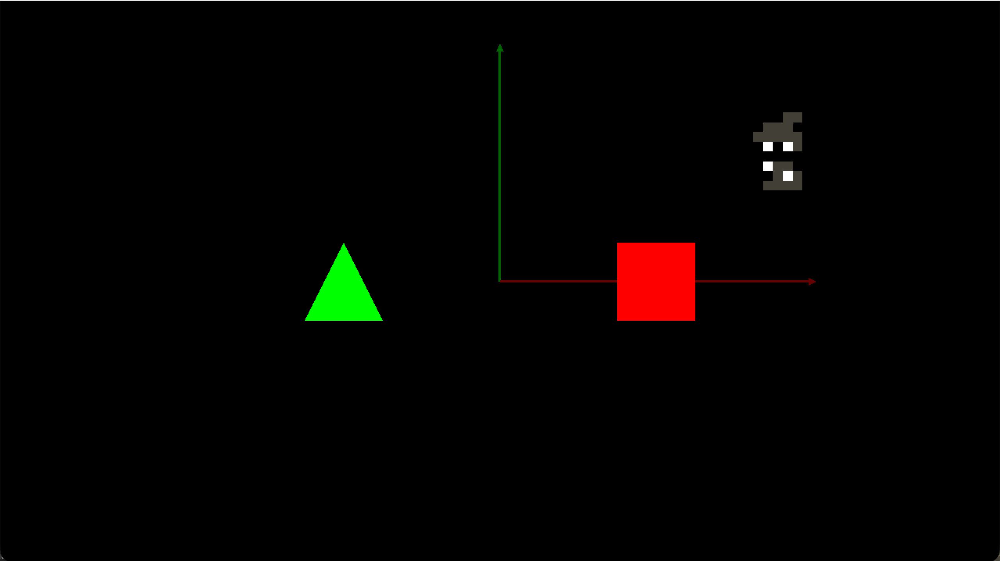
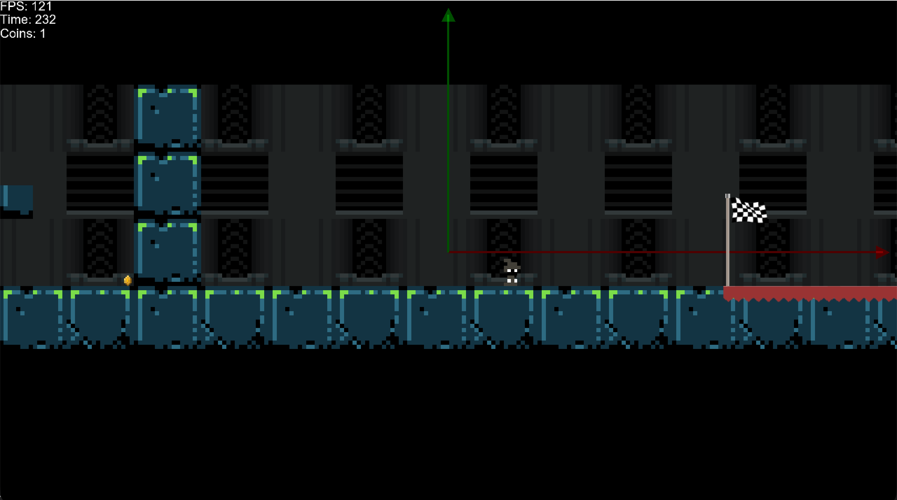
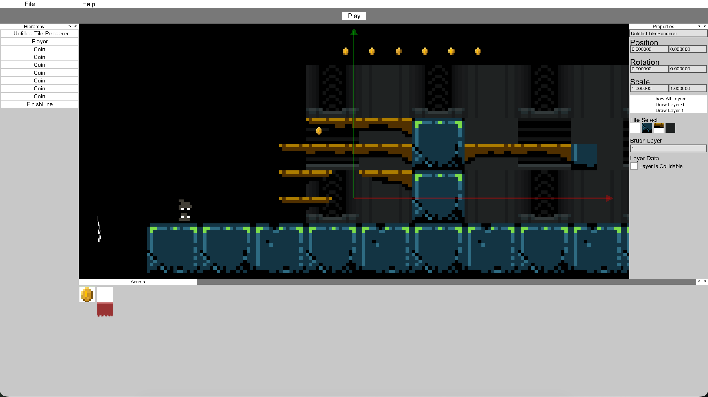
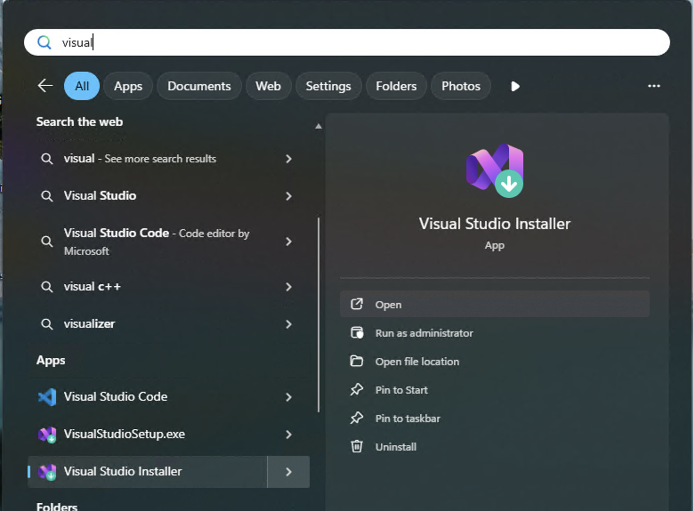
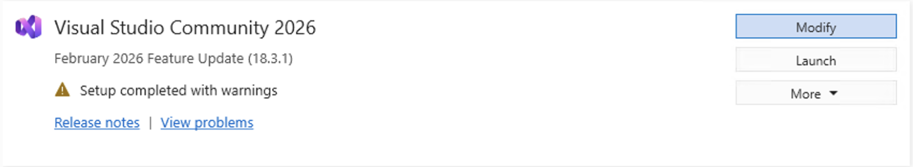
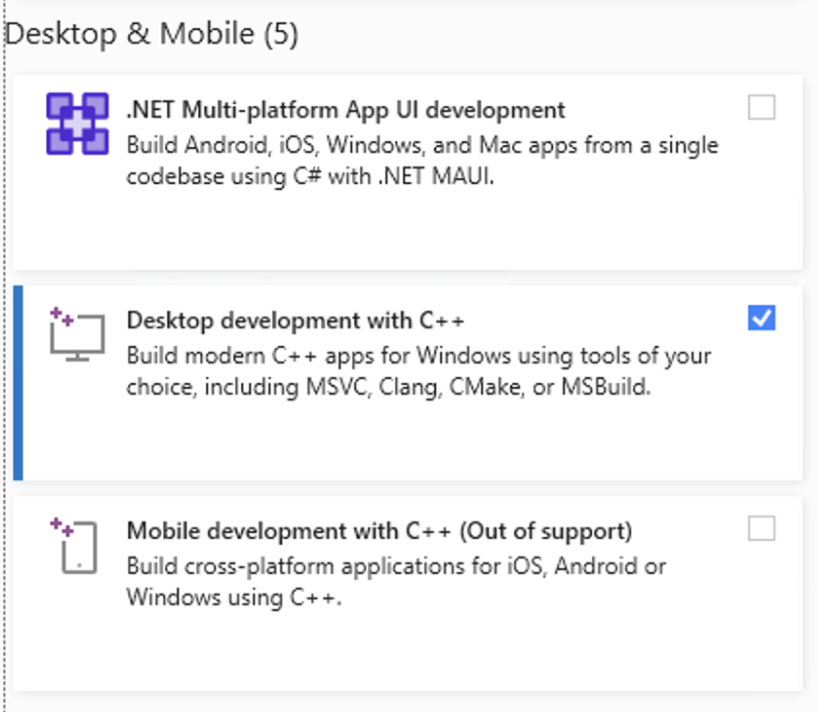
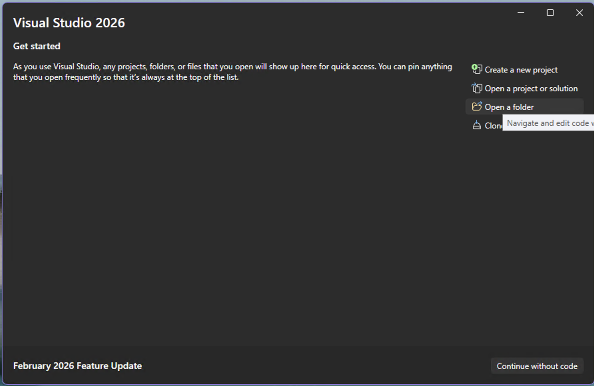
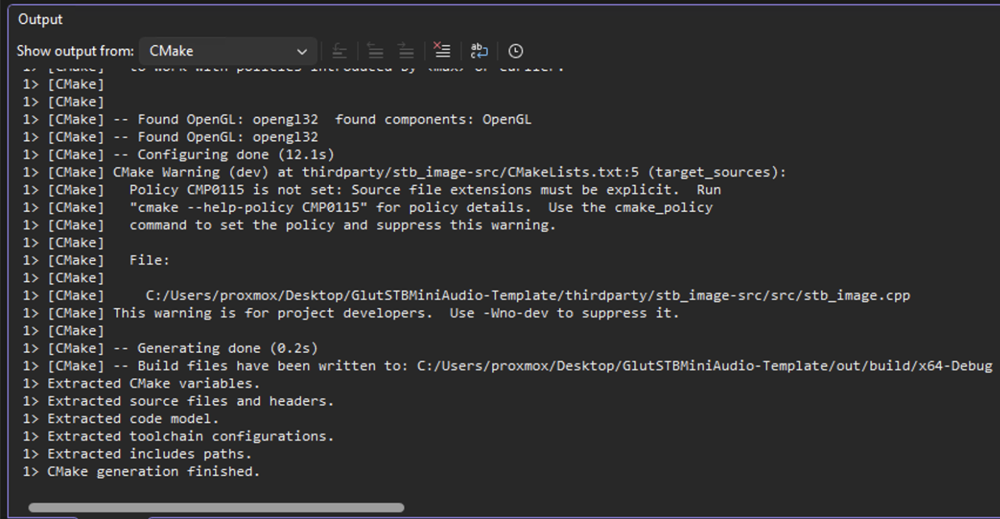
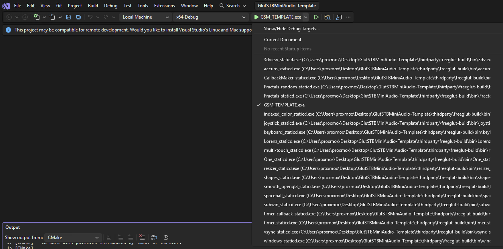
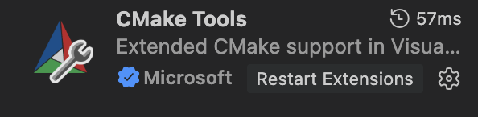

# Game Engine Concepts

## About
This project was created as part of a Kent State University class.  The goal of the class was to make a game from scratch using the GLUT window library.  The game is created in raw C++ and uses OpenGL for graphics, Glut creates the window and the rendering context for the application.

The assignment was broken into 4 parts:

- #### Assignment1
    Create a basic player that moves around the screen and throw some shapes on the screen.
    

- #### Assignment2
    Create a simple level where the player has gravity, collision, and collectables.  The game must also have a goal to reach.
    

- #### Assignment3
    Create an editor for the game. It must allow any user to modify the level, or create one as they choose.  They would be able to test the level and return back to make any changes they wish.
    

- #### Assignment4
    Finally, using everything that has been done, create a final game that can save to a file and be loaded by any user.


## Building the Game
This information is taken directly from **[arizotaz/GlutGameTemplate](https://github.com/arizotaz/GlutGameTemplate)**
### For Windows
1. Install Visual Studio <br>
Make sure you have installed Visual Studio, not Visual Studio Code, you need the MSVC Compiler installed which is bundled and accessible with Standard Visual Studio

2. Open the Visual Installer<br>


3. Modify your Visual Studio Installation<br>


4. Make sure "Desktop Development wiht C++" is installed<br>


5. Once installed open Visual Studio and select "Open a folder", then find and select the folder of this project


6. When the project opens, CMake should immedately start installing thirdparty dependencies. Please make sure you see *"CMake generation finished"* before continuing.


7. Finally select the correct Target from the Target list, to the right of the run button. 


8. Finally press the run button and the application should just work


### For MacOS

1. There are many different ways to use CMake on Mac or Linux.  Visual Studio works great, but its a [Command Line Interface](###CLI) application so it's easy to use anywhere.<br>
However, for this guide, install Visual Studio Code and [Brew](https://brew.sh).  Brew is like apt for MacOS, if you don't want to install it, find some way to install CMake.

2. Open this project in Visual Studio Code.
3. In the extensions tab, find and install "CMake Tools"

4. You may need to reload the project, so do that with CMD+Shift+P, search for *"Reload Window"*, and Press *enter*
5. When the project opens, it should immediately start downloading the libraries that this project needs.  Please wait until it completes or you see *"CMake generation finished"* in the console.
6. Once CMake has finished configuring, press Shift+F5 (You may also need to press fn depending on how your mac is setup), and the application will run.


### CLI
To compile the project with normal cmake, it's stupid easy.
```
cmake .; make;
```
The binary should be in the root of the project after it is installed so run 
```
./Assignment4
```